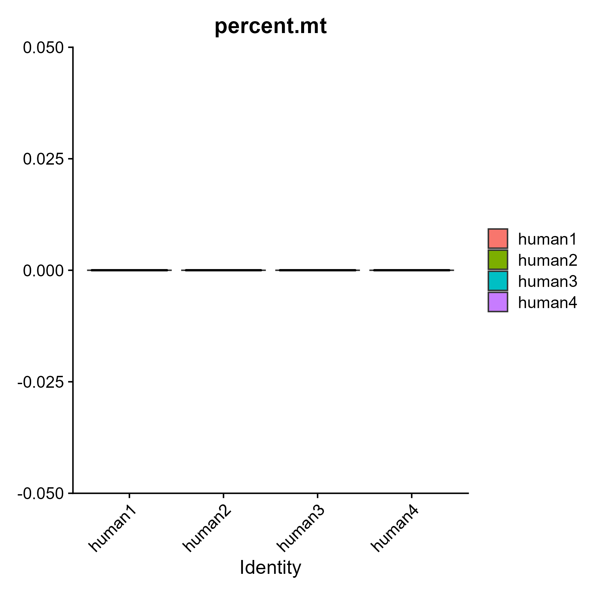
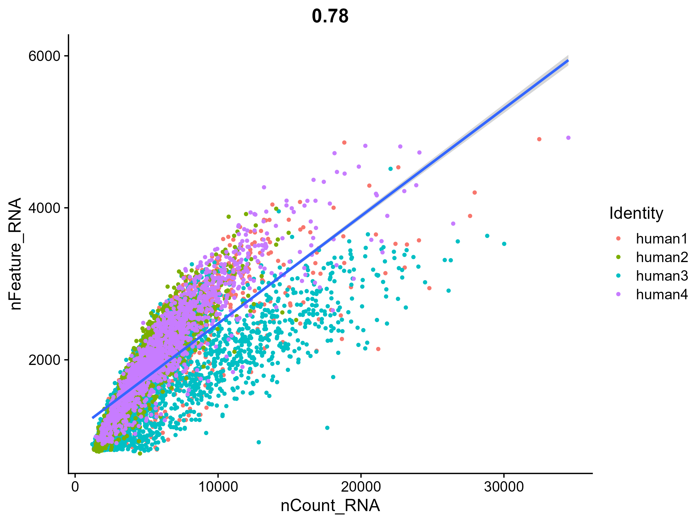
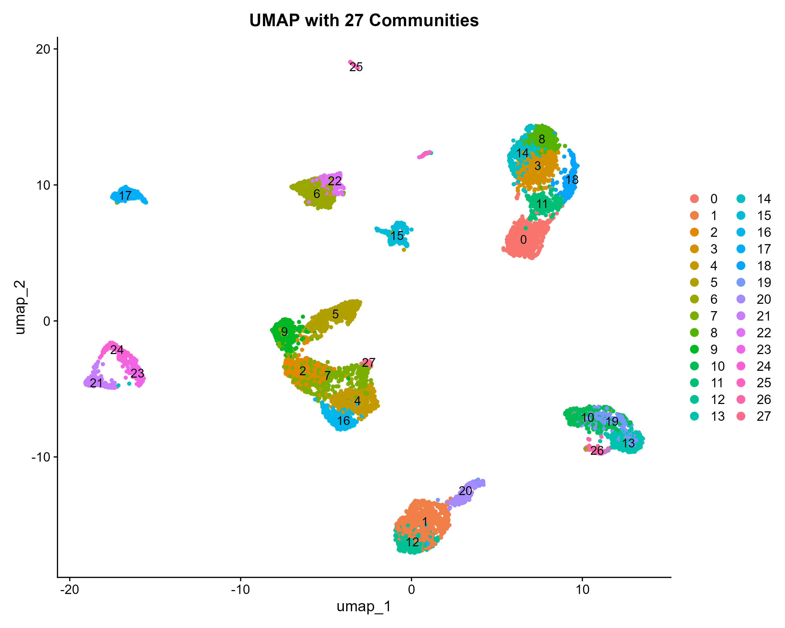
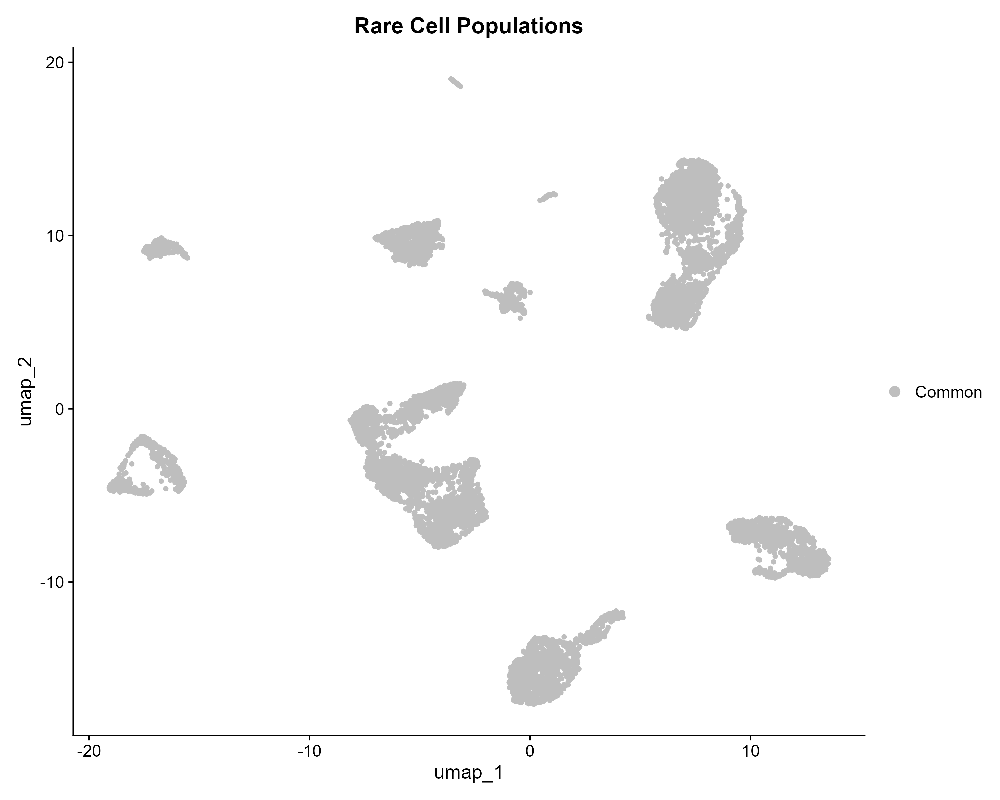
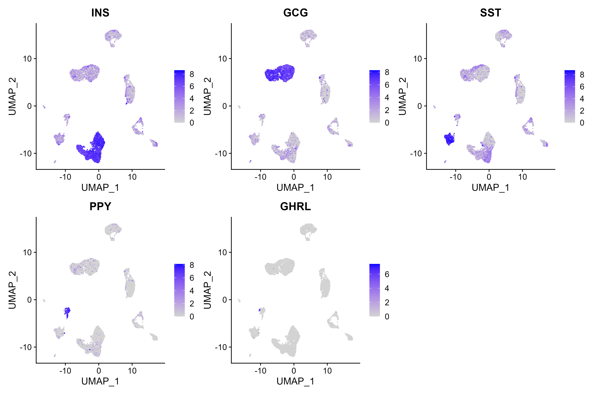
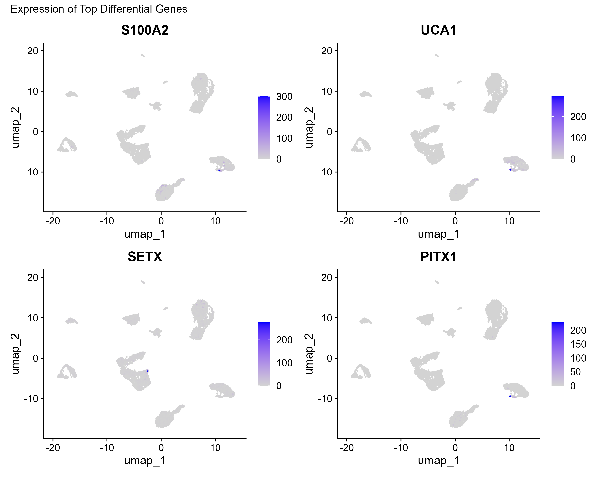
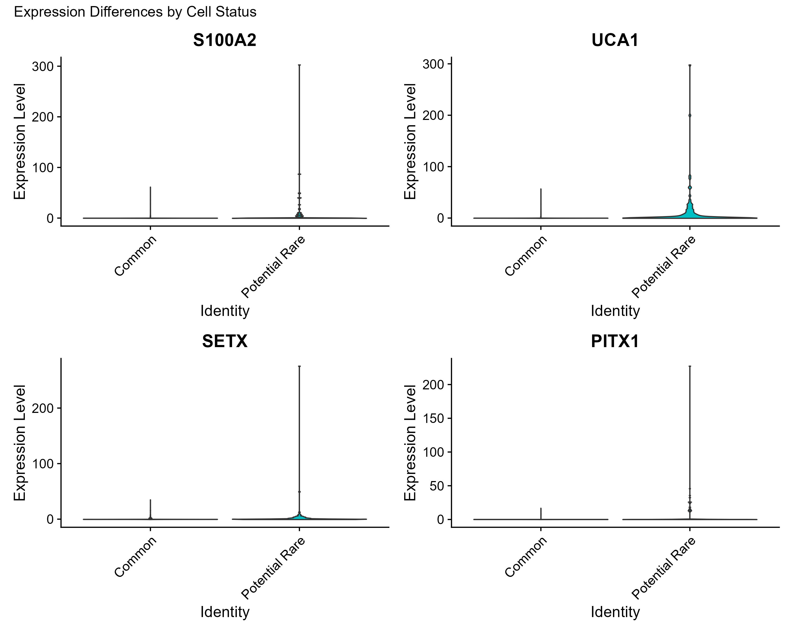

# **immune-chord: R Pipeline for Identifying Rare Cell Populations**


A robust R pipeline designed for the identification and characterization of rare cell populations in single-cell RNA sequencing data, utilizing Seurat and BigSur.

## 📋 Overview

**immune-chord** offers a standardized and reproducible workflow for identifying rare cell populations, such as neural crest stem cells and uncommon immune subsets, in single-cell RNA sequencing data. This pipeline encompasses the entire analysis lifecycle, from raw data processing to advanced statistical analysis and visualization.

### **Key Features**

- **Rare Cell Detection**: Utilizes the BigSur algorithm for precise identification of rare populations
- **Complete Workflow**: Provides end-to-end processing, from quality control to biological interpretation
- **Reproducible**: Features Conda environment management and thorough documentation for consistency
- **Adaptive Analysis**: Capable of addressing scenarios where strict criteria for rare cells are not met
- **Publication-Ready**: Produces high-quality visualizations and comprehensive reports suitable for publication

## 🚀 Quick Start

### Installation

1. **Create Conda Environment**:

```bash
conda create -n immune-chord -c conda-forge r-base=4.3.2 r-essentials
conda activate immune-chord
```

2. **Install R Packages**:

```bash
conda install -c conda-forge r-seurat r-tidyverse r-devtools r-remotes r-biocmanager
conda install -c bioconda bioconductor-singlecellexperiment bioconductor-scran
```

3. **Install BigSur**:

```r
remotes::install_github("landerlabcode/BigSurR")
```

### Basic Usage

```r
# Load data
library(scRNAseq)
pancreas_data <- BaronPancreasData(which = "human")
seu_obj <- CreateSeuratObject(counts = counts(pancreas_data))

# Run full pipeline
source("R/01_chord_quality_control_normalization.R")
source("R/02_chord_clustering_celltype_id.R")
source("R/03_chord__population_analysis.R")
source("R/04_chord_differential_expression_visualization.R")
```

---

## 📁 Project Structure

```
immune-chord/
├── data/
│   ├── raw_data/                 # Raw data (with README for download instructions)
│   └── processed_data/           # Processed datasets (.rds files)
├── R/                            # Pipeline scripts
│   ├── 01_chord_quality_control_normalization.R
│   ├── 02_chord_clustering_celltype_id.R
│   ├── 03_chord__population_analysis.R      # Uses BigSur
│   ├── 04_chord_differential_expression_visualization.R
│   └── functions.R               # Helper functions
├── analysis/
│   └── vignette.Rmd              # Complete tutorial
├── docs/
│   └── tutorial.md               # Rendered tutorial
├── figures/                      # Output plots (move PNG files here)
└── README.md
```

---

## 📊 Recommended Datasets

1. **BaronPancreasData** (easiest for testing):

```r
library(scRNAseq)
data <- BaronPancreasData(which = "human")
```

2. **10X Genomics PBMC** (standard benchmark):
   - Download: [10x Genomics Datasets](https://www.10xgenomics.com/datasets)
   - Contains  dendritic cells and progenitors

3. **Tabula Sapiens** (comprehensive atlas):
   - Download: [Tabula Sapiens Portal](https://tabula-sapiens-portal.ds.czbiohub.org/)
   - Includes  cell types across multiple tissues

## 🔧 Configuration

### Key Parameters

| Parameter | Default | Description |
| --- | --- | --- |
| `min_features` | 200 | Minimum features per cell |
| `max_mito` | 10 | Maximum mitochondrial percentage |
| `fano.alpha` | 0.05 | FDR cutoff for variable features |
| `min.fano` | 1.5 | Minimum Fano factor threshold |
| `resolution` | 1.2 | Clustering resolution |

### Example Analysis

```r
# Custom parameter analysis
results <- BigSur(
  seurat.obj = your_data,
  assay = "RNA",
  counts.slot = "counts",
  variable.features = TRUE,
  correlations = FALSE,
  fano.alpha = 0.05,
  min.fano = 1.5
)
```

## 📈 Example Output

The pipeline generates various visualizations, including:

### Quality Control

*Violin plots showing quality metrics (nFeature_RNA, nCount_RNA, percent.mito).*


*Scatter plot relating nFeature_RNA to mitochondrial percentage.*


*Scatter plot showing relationship between nFeature_RNA and nCount_RNA.*

### Dimensionality Reduction & Clustering

*Elbow plot for determining significant principal components.*


*UMAP visualization showing initial cluster assignments.*

### Rare Cell Population Analysis

*UMAP showing 27 distinct cell communities identified.*


*UMAP highlighting rare cell populations identified by BigSur.*

### Marker & Differential Expression

*Feature plots showing spatial expression of key marker genes across clusters.*


*Feature plots of differentially expressed genes for rare populations.*


*Violin plots showing expression patterns of key DE genes across clusters.*


*UMAP visualization colored by cell status or experimental condition.*

## 🐛 Troubleshooting

### Common Issues

1. **No rare cells detected**:

```r
# Adaptive analysis for small clusters
cluster_sizes <- table(seurat_obj$seurat_clusters)
small_clusters <- names(cluster_sizes[cluster_sizes < 10])  # Adjust threshold
```

2. **Memory issues**:

```r
options(future.globals.maxSize = 8000 * 1024^2)  # Increase to 8GB
```

3. **Zero-count genes error**:

```r
# Filter zero-count genes before BigSur
count_matrix <- GetAssayData(seurat_obj, assay = "RNA", slot = "counts")
zero_count_genes <- which(Matrix::rowSums(count_matrix) == 0)
count_matrix <- count_matrix[-zero_count_genes, ]
```

## 🤝 Contributing

We welcome contributions! Please feel free to submit issues, feature requests, or pull requests.

1. Fork the repository
2. Create a feature branch (`git checkout -b feature/amazing-feature`)
3. Commit your changes (`git commit -m 'Add amazing feature'`)
4. Push to the branch (`git push origin feature/amazing-feature`)
5. Open a Pull Request

## 📄 License

This project is licensed under the MIT License - see the [LICENSE](LICENSE) file for details.

## 🙏 Acknowledgments

- **BigSur** developers: [landerlabcode/BigSur](https://github.com/landerlabcode/BigSur)
- **Seurat** team: For the comprehensive single-cell analysis framework
- **10x Genomics**: For providing benchmark datasets
- **Bioconductor**: For maintaining essential bioinformatics packages

## 📚 Citation

If you use immune-chord in your research, please cite:

```
@software{immune-chord,
  title = {immune-chord: An R Pipeline for Rare Cell Population Identification},
  author = {Your Name and Contributors},
  year = {2024},
  url = {https://github.com/yourusername/immune-chord},
  note = {Version 1.0}
}
```

## 🔗 Useful Links

- [Seurat Documentation](https://satijalab.org/seurat/)
- [Bioconductor](https://bioconductor.org/)
- [Single Cell Best Practices](https://www.sc-best-practices.org/)

---

**Note**: This pipeline is under active development. Please report any issues or suggestions for improvement through the GitHub issues page.
