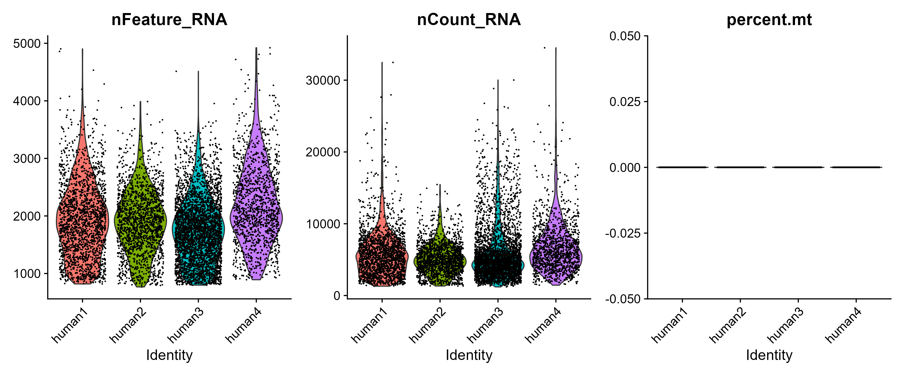
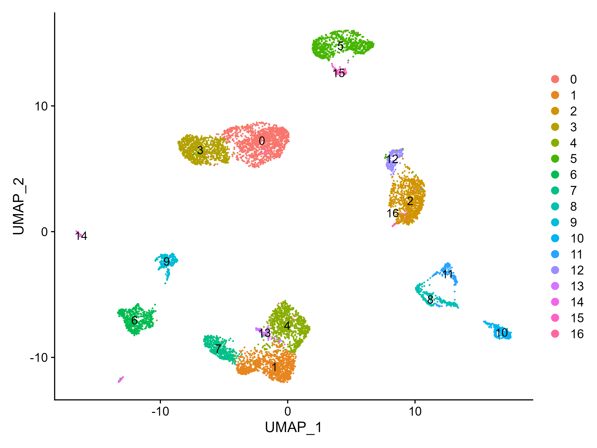
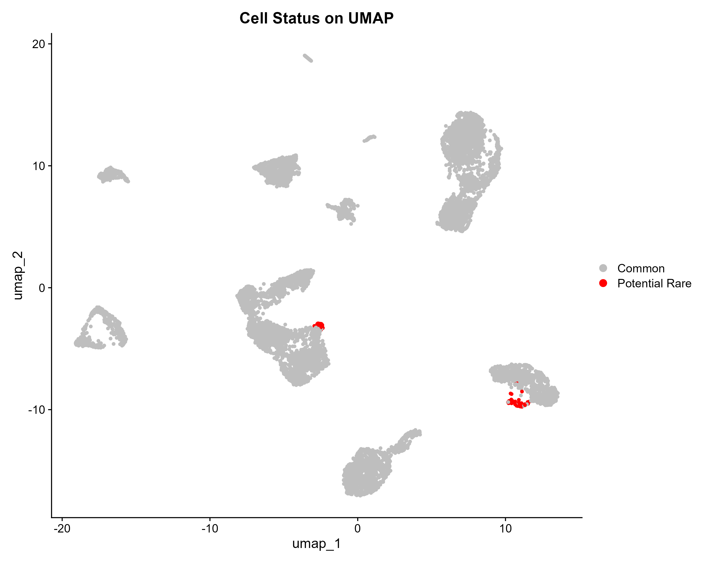

# immune-chord: R Pipeline for Identifying Rare Cell Populations


A robust R pipeline designed for the identification and characterization of rare cell populations in single-cell RNA sequencing data, utilizing Seurat and BigSur.


*UMAP projection highlighting rare cell populations identified by the BigSur algorithm*

## 📋 Overview

`immune-chord` offers a standardized and reproducible workflow for identifying rare cell populations, such as neural crest stem cells and uncommon immune subsets, in single-cell RNA sequencing data. This pipeline encompasses the entire analysis lifecycle, from raw data processing to advanced statistical analysis and visualization.

### 🎯 Key Features

- **Rare Cell Detection**: Utilizes the BigSur algorithm for precise identification of rare populations
- **Complete Workflow**: Provides end-to-end processing, from quality control to biological interpretation
- **Reproducible**: Features Conda environment management and thorough documentation for consistency
- **Adaptive Analysis**: Capable of addressing scenarios where strict criteria for rare cells are not met
- **Publication-Ready**: Produces high-quality visualizations and comprehensive reports suitable for publication

## 🚀 Quick Start

### Input & Output

- **Input**: A Seurat object or raw count matrix from scRNA-seq data
- **Output**: Identified rare cell populations, marker genes, differential expression results, and publication-quality visualizations

### Installation

1. **Create and activate Conda Environment**:
```bash
conda create -n immune-chord -c conda-forge r-base=4.3.2 r-essentials
conda activate immune-chord
```

2. **Install R Dependencies**:
```bash
# Install CRAN packages
install.packages(c("Seurat", "tidyverse", "devtools", "remotes", "BiocManager"))

# Install Bioconductor packages
BiocManager::install(c("SingleCellExperiment", "scran"))

# Install BigSur
remotes::install_github("landerlabcode/BigSurR")
```

3. **Run the pipeline**:
```r
# Load your data (example with test data)
library(scRNAseq)
pancreas_data <- BaronPancreasData(which = "human")
seu_obj <- CreateSeuratObject(counts = counts(pancreas_data))

# Execute the full pipeline
source("R/01_chord_quality_control_normalization.R")
source("R/02_chord_clustering_celltype_id.R")
source("R/03_chord_rare_population_analysis.R")  # Uses BigSur
source("R/04_chord_differential_expression_visualization.R")
```

## 📁 Project Structure

```
immune-chord/
├── data/
│   ├── raw_data/                 # Raw data (with README for download instructions)
│   └── processed_data/           # Processed datasets (.rds files)
├── R/                            # Pipeline scripts
│   ├── 01_chord_quality_control_normalization.R
│   ├── 02_chord_clustering_celltype_id.R
│   ├── 03_chord_rare_population_analysis.R      # Uses BigSur
│   ├── 04_chord_differential_expression_visualization.R
│   └── functions.R               # Helper functions
├── analysis/
│   └── vignette.Rmd              # Complete tutorial
├── docs/
│   └── tutorial.md               # Rendered tutorial
├── figures/                      # Output plots
├── session_info.txt              # Session information for reproducibility
└── README.md
```

## 📊 Recommended Datasets

1. **BaronPancreasData** (easiest for testing):
```r
library(scRNAseq)
data <- BaronPancreasData(which = "human")
```

2. **10X Genomics PBMC** (standard benchmark):
   - Download: [10x Genomics Datasets](https://www.10xgenomics.com/datasets)
   - Contains rare dendritic cells and progenitors

3. **Tabula Sapiens** (comprehensive atlas):
   - Download: [Tabula Sapiens Portal](https://tabula-sapiens-portal.ds.czbiohub.org)
   - Includes rare cell types across multiple tissues

## 🔧 Configuration

### Key Parameters

| Parameter | Default | Description |
|-----------|---------|-------------|
| min_features | 200 | Minimum features per cell |
| max_mito | 10 | Maximum mitochondrial percentage |
| fano.alpha | 0.05 | FDR cutoff for variable features |
| min.fano | 1.5 | Minimum Fano factor threshold |
| resolution | 1.2 | Clustering resolution |

### Example Analysis

```r
# Custom parameter analysis
results <- BigSur(
  seurat.obj = your_data,
  assay = "RNA",
  counts.slot = "counts",
  variable.features = TRUE,
  correlations = FALSE,
  fano.alpha = 0.05,
  min.fano = 1.5
)
```

## 📈 Example Outputs

The pipeline generates various visualizations and results:

### Quality Control

*Violin plots showing quality metrics (nFeature_RNA, nCount_RNA, percent.mito)*

### Dimensionality Reduction

*UMAP visualization showing cell clustering*

### Rare Cell Identification

*UMAP highlighting rare cell populations identified by BigSur*

### Differential Expression

*Volcano plot of differentially expressed genes in rare populations*

## 🐛 Troubleshooting

### Common Issues

1. **No rare cells detected**:
```r
# Try adjusting parameters
results <- BigSur(
  seurat.obj = your_data,
  fano.alpha = 0.1,  # Less strict FDR
  min.fano = 1.2     # Lower Fano threshold
)
```

2. **Memory issues**:
```r
# Increase memory allocation
options(future.globals.maxSize = 8000 * 1024^2)  # 8GB
```

3. **Installation problems**:
   - Check `session_info.txt` for package versions
   - Ensure all system dependencies are installed

### Reproducibility

For exact environment replication, refer to `session_info.txt` which contains:
- R version and platform information
- Loaded package versions
- System dependencies

## 🤝 Contributing

We welcome contributions! Please feel free to submit issues, feature requests, or pull requests.

1. Fork the repository
2. Create a feature branch (`git checkout -b feature/amazing-feature`)
3. Commit your changes (`git commit -m 'Add amazing feature'`)
4. Push to the branch (`git push origin feature/amazing-feature`)
5. Open a Pull Request

## 📄 License

This project is licensed under the MIT License - see the [LICENSE](LICENSE) file for details.

## 🙏 Acknowledgments

- **BigSur developers**: [landerlabcode/BigSur](https://github.com/landerlabcode/BigSur)
- **Seurat team**: For the comprehensive single-cell analysis framework
- **10x Genomics**: For providing benchmark datasets
- **Bioconductor**: For maintaining essential bioinformatics packages

## 📚 Citation

If you use `immune-chord` in your research, please cite:

```bibtex
@software{immune_chord,
  title = {immune-chord: An R Pipeline for Rare Cell Population Identification},
  author = {Perez, Constanza},
  year = {2024},
  url = {https://github.com/ceugenia/immune-chord},
  note = {Version 1.0}
}
```

## 🔗 Useful Links

- [Seurat Documentation](https://satijalab.org/seurat/)
- [Bioconductor](https://bioconductor.org/)
- [Single Cell Best Practices](https://www.sc-best-practices.org/)

---

*Note: This pipeline is under active development. Please report any issues or suggestions for improvement through the GitHub issues page.*
